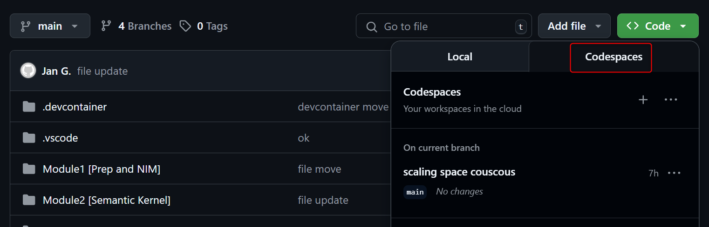

# Introduction

Normally, all the pre-requisites should be installed on the VM that is available in the Lab environment
If it is not the case, follow the steps below to install the necessairy tools and extensions. 

## Install VSCODE and some extensions

1. Install VSCODE
    ```
    1. winget install --id Microsoft.VisualStudioCode --source winget --accept-package-agreements  --accept-source-agreements
    ```
2. Install VSCODE Extensions (Open bash terminal in VSCODE)

    ```
    1. chmod +x install-vscode-and-extensions.sh
    2. ./install-vscode-and-extensions.sh
    ```

3. The repo (https://aka.ms/WintercircusAiHack)

    Here you have 2 options:

    * You ***clone*** the repo locally on the Lab VM
    ```
    git clone <The Above Repo> 
    ```

    * You use ***codespaces***
    ```
        1. Open a browser on the lab VM
        2. Point to the repo
        3. Launch a code space
    ```
    
    