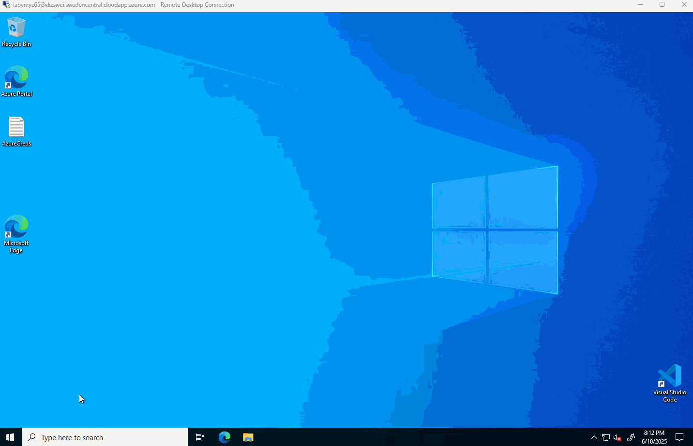
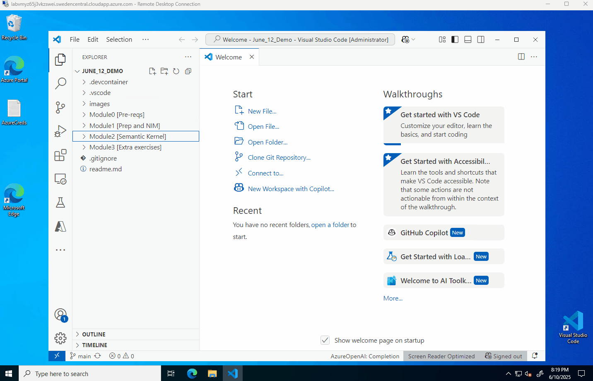

# Introduction

Normally, all the pre-requisites should be installed on the VM that is available in the Lab environment
If it is not the case, follow the steps below to install the necessary tools and extensions. 

## Install VSCODE and some extensions

1. **Clone** the repository locally on the Lab VM
    ```
    git clone git@github.com:jgezelscorp/June_12_Demo.git
    ```
    
2. Install VSCODE, if not already installed.
    ```
    winget install --id Microsoft.VisualStudioCode --source winget --accept-package-agreements  --accept-source-agreements
    ```
   NOTE: If you are using the Lab VM, VS Code should already be installed. 
   If `winget` is not installed. Download VS Code manually and install it https://code.visualstudio.com/download


3. Open the project in VS Code (Repo URL: https://aka.ms/WintercircusAiHack)

    Here you have two options:

    * Use locally cloned repo on the Lab environment in step 1
    * You use ***codespaces***
    ```
        1. Open a browser on the lab VM
        2. Point to the repo
        3. Launch a code space
    ```
    

    
4. Install VSCODE Extensions (Open bash terminal in VSCODE, see additional tip)

    ```
    chmod +x install-vscode-and-extensions.sh
    ./install-vscode-and-extensions.sh
    ```
---

## Addition Tips:
Open Project in VSCODE



Open a bash terminal and install the extensions
