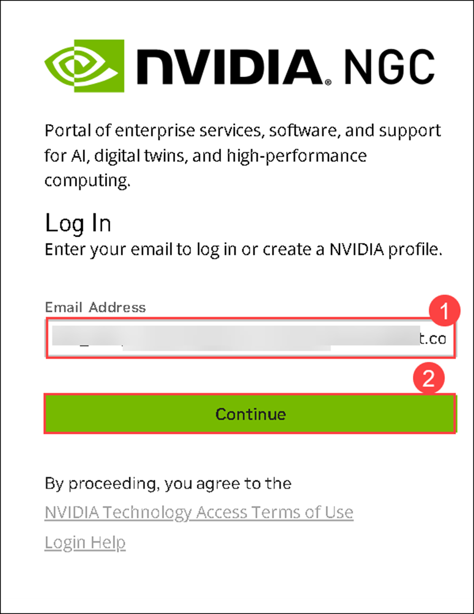
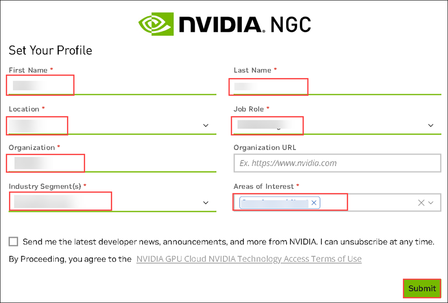
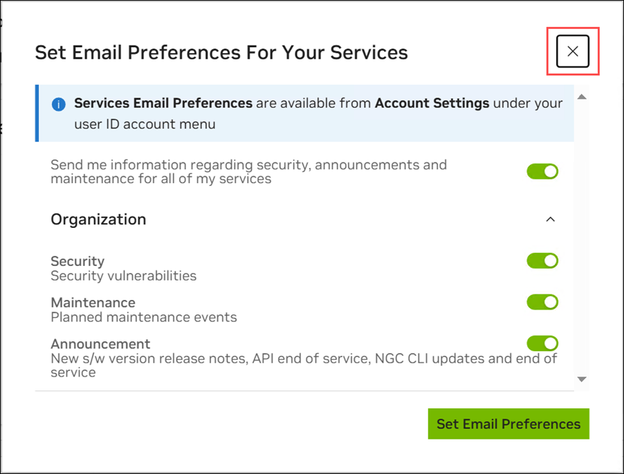
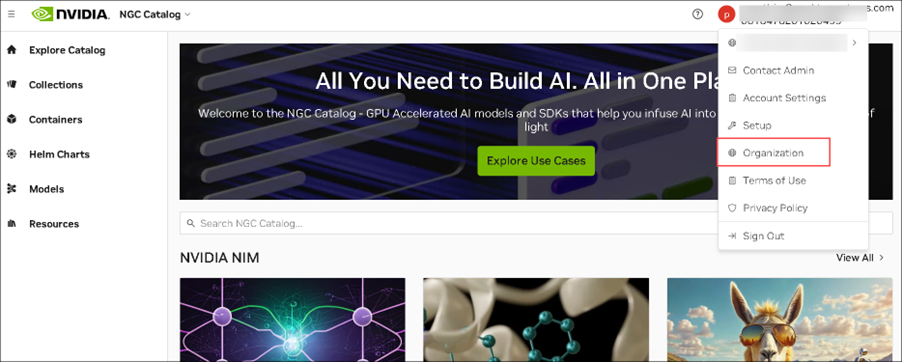
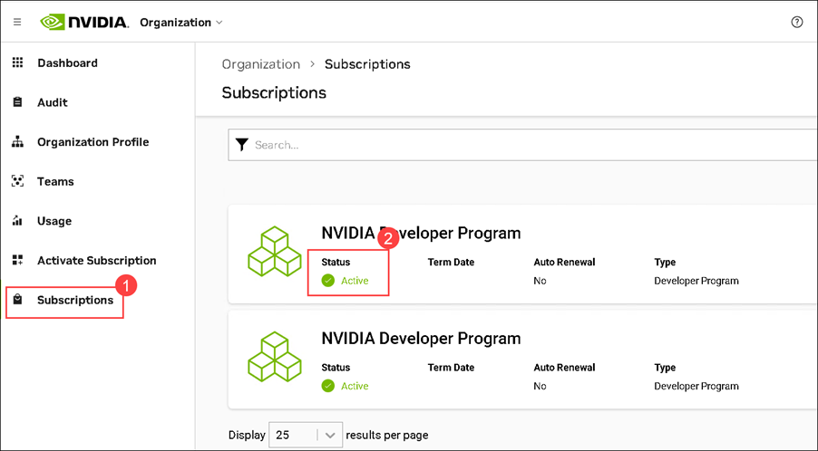
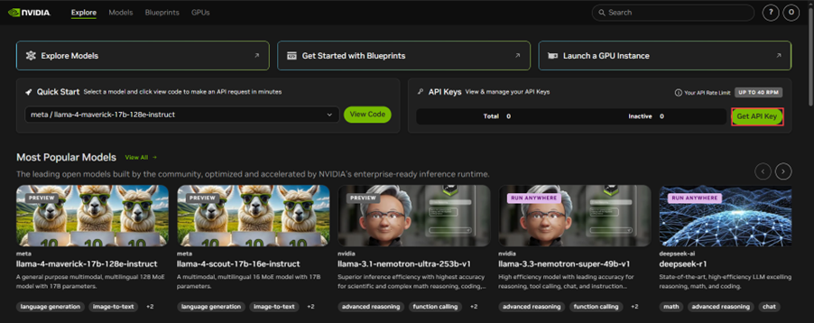
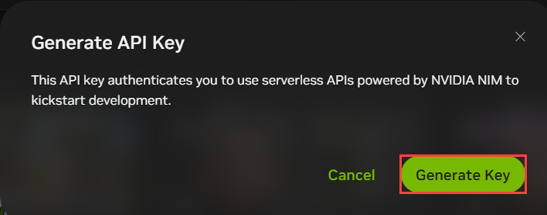

# Part 1: Azure AI Foundry

In this step, we'll setup AI Foundry where we will deploy and configure our models. As far as LLMs go, we're going to do something special.
<br>

We are going to deploy **model Router** which consist of 
1. **GPT-4.1**
2. **GPT-4.1 Nano**
3. **GPT-4.1 Mini**

These models will be deployed behind an API Endpoint and the router will select the most optimal model to be used.

By using Model Router, we are able to achieve a 60% cost reduction while preserving almost the same accuracy as if we would only use GPT-4.1

For Embedding, we'll deploy the ADA-2 model.

## Log-in

Use the account that your coach has given you


Select "No" when asked to keep being signed in


## 1. Create the Azure AI Foundry Project

Once logged in, type "AI Foundry" in the search bar, select it and create a resource


* Create a Resource Group
* Give the Foundry Resource a name
* Select ***Sweden Central*** as a region
* Give your first project a name
<br>

Leave all the reset as-is. Remember that you could use
private endpoints and other features to protect your resources which you typicaly would do in a production environment.


Once deployed, go to your Resource (AI Foundry instance) and click ***Go To AI Foundry Portal*** or open an a browser and go to ***https://ai.azure.com***


💡We are using a non-hub project type which means you will not see *all* models.💡


## 2. Configure the Azure AI Foundry Project

Once you are in foundry, make sure you are in the project.
Note down the following information as we'll need this to populate our ***.env file***


In the overview tab, do the following:
1. Copy the ***API Key***
2. Click on ***Azure OpenAI***
3. Copy the ***OpenAI endpoint***

Next, let's deploy our LLM. Remember, we'll be using ***Model-Router*** in our setup so:
1. go to ***Models & Endpoints***
2. Click the ***Deploy base model*** 


3. look for ***Model-Router***
4. Click ***Confirm***


You'll notice that for ***Model-Router***, there is currently only a ***Global Standard*** deployment type meaning that Microsoft will choose where inferencing is happening. 

This could be outside of Europe so be aware. For our hack, this doesn't really matter and as a result we get a lot of ***TPM*** & ***RPM***


<hr style="border: 2px solid #ccc; margin: 30px 0;">

***Repeat this step for ADA-2 & any other model you want to deploy***


<hr style="border: 2px solid #ccc; margin: 30px 0;">

<br>

# Part 2: Nvidia NIM

## Introduction

NVIDIA NIM is a suite of highly optimized microservices designed to simplify and accelerate the deployment of generative AI models across cloud, data centers, and workstations. Each NIM is packaged as a container image on a per model or model family basis, such as meta/llama3-8b-instruct, and can run on any NVIDIA GPU with sufficient memory. 

NIMs leverage a runtime that intelligently selects the best model version for the available hardware, ensuring optimal performance.

NIMs are distributed as Docker containers via the NVIDIA NGC Catalog, with each container including built-in security features, such as CVE monitoring and security scanning reports. NIMs offers flexible, scalable deployment options and is compatible with a wide range of NVIDIA GPUs, making it the fastest solution for AI inference.

You need to deploy NVIDIA NIM on Azure Kubernetes Service for Challenge 2.1:
<br>&emsp;•	Azure Kubernetes Service - Deploy using a helm chart on a single ***Standard_NC24ads_A100_v4*** node pool


## Deploy NVidia NIM

Your task in this challenge is to create an NIM endpoint on Azure by deploying llama-3.1-8b-instruct NIM in the Azure environment of your choice.
Accessing the Azure Portal

## Task 1: Generate NGC API KEY

1. Login or Create Nvidia account  
    - Navigate to [https://build.nvidia.com/](https://build.nvidia.com/) and login using your personal email id. If not, ***create an account***  
    - Navigate to https://ngc.nvidia.com/signin account using your credentials to proceed.




2. Once your account is created or you've successfully logged in.

3. You will see a pop-up. On the ***Set Email Preferences For Your Services*** page, you can either close it or click ***Set Email Preferences*** to receive updates regarding security, announcements, and maintenance for all your services.
    
4. Navigate back to your NVIDIA Account. Select Organization.

    

Click Subscriptions (1) on the left. Here, you will see the Active (2) status for the NVIDIA Developer Program.
<br><br>&emsp; 

Now, go back to https://build.nvidia.com and click on ***Get API Key***
        

Next, click on Generate API Key.
<br><br>&emsp; 

***Once the key is generated, click on Copy Key and save it in a notepad or text editor for later use in this lab. You can always find it back at : https://org.ngc.nvidia.com/setup/api-keys***


## Task 2: Prepare Your Environment

***Following is the detail instructions to install from a bash***

### 2.1 Install Azure CLI

```
curl -sL https://aka.ms/InstallAzureCLIDeb | sudo bash
```

### 2.2 Install AKS Preview extension

```
az extension add --name aks-preview
az extension update --name aks-preview
```

For more detail, Please reference this [link.](https://learn.microsoft.com/en-us/azure/aks/draft)

### 2.3 Install kubectl

```
curl -LO "https://dl.k8s.io/release/$(curl -L -s https://dl.k8s.io/release/stable.txt)/bin/linux/amd64/kubectl"
```

```
curl -LO "https://dl.k8s.io/release/$(curl -L -s https://dl.k8s.io/release/stable.txt)/bin/linux/amd64/kubectl.sha256"
```
```
echo "$(cat kubectl.sha256)  kubectl" | sha256sum --check
```

```
sudo install -o root -g root -m 0755 kubectl /usr/local/bin/kubectl
```

```
kubectl version --client
```

### 2.4 Install helm

```
curl -fsSL -o get_helm.sh https://raw.githubusercontent.com/helm/helm/main/scripts/get-helm-3
```
```
chmod 700 get_helm.sh
```
```
./get_helm.sh
```

## Task 3: Setup Azure Kubernetes Service (AKS)

The key to creating Azure Kubernetes Service (AKS) for NIM is to create proper GPU nodepool.  The following steps guide you how to find it.

### 3.1 Set the correct Azure Sub

It should be ok but set the correct Azure Subscription
```
az account set --subscription <subscription name>
```

### 3.2 Identify GPU needed for NIM

- Go to NIM document to find the GPU you [need](https://docs.nvidia.com/nim/large-language-models/latest/support-matrix.html) and convert to Azure VM

Following is the example

#### Llama 3 8B Instruct

| GPU   | GPU Memory  | Precision | Profile    | # of GPUS | Azure VM Instance         | Azure VM Family |
| ----- | ----------- | --------- | ---------- | --------- | ------------------------- | --------------- |
| H100  | 94          | FP8       | Throughput | 1         | Standard_NC40adis_H100_v5 | NCads H100 v5   |
| H100  | 188         | FP8       | Latency    | 2         | Standard_NC80adis_H100_v5 | NCads H100 v5   |
| H100  | 94          | FP16      | Throughput | 1         | Standard_NC40adis_H100_v5 | NCads H100 v5   |
| H100  | 188         | FP16      | Latency    | 2         | Standard_NC80adis_H100_v5 | NCads H100 v5   |
| A100  | 80          | FP16      | Throughput | 1         | Standard_NC24ads_A100_v4​  | NCADS_A100_v4   |
| A100  | 160         | FP16      | Latency    | 2         | Standard_NC48ads_A100_v4  | NCADS_A100_v4   |
| L40S  | 48          | FP8       | Throughput | 1         |                                             |
| L40S  | 96          | FP8       | Latency    | 2         |                                             |
| L40S  | 48          | FP16      | Throughput | 1         |                                             |
| A10G  | 24          | FP16      | Throughput | 1         | Standard_NV36ads_A10_v5   | NVadsA10 v5     |
| A10G  | 48          | FP16      | Latency    | 2         | Standard_NV72ads_A10_v5   | NVadsA10 v5     |

#### Llama 3 70B Instruct

| GPU   | GPU Memory  | Precision | Profile    | # of GPUS | Azure VM Instance         | Azure VM Family |
| ----- | ----------- | --------- | ---------- | --------- | ------------------------- | --------------- |
| H100  | 320         | FP8       | Throughput | 4         | Standard_ND96isr_H100_v5  | ND H100 v5      |
| H100  | 640         | FP8       | Latency    | 8         | Standard_ND96isr_H100_v5  | ND H100 v5      |
| H100  | 320         | FP16      | Throughput | 4         | Standard_ND96isr_H100_v5  | ND H100 v5      |
| H100  | 640         | FP16      | Latency    | 8         | Standard_ND96isr_H100_v5  | ND H100 v5      |
| A100  | 320         | FP16      | Throughput | 4         | Standard_ND96amsr_A100_v4​ | NDAMSv4_A100    |
| L40S  | 192         | FP8       | Throughput | 4         |
| L40S  | 384         | FP8       | Latency    | 8         |

### 3.3 Find the region has desired GPU

***The region where you will be deploying is mentioned in the Guide in
the lab environment or ask the coaches.***

### 3.4 Create AKS

```
az aks create -g <resource group name> -n <aks name> --location <location has desired GPU> --zones <zone has desired GPU> --generate-ssh-keys
```

### 3.5 Create GPU nodepool

```
az aks nodepool add --resource-group <resource group name> --cluster-name <aks name> --name <nodepool name> --node-count 1 --skip-gpu-driver-install --node-vm-size standard_nc24ads_a100_v4 --node-osdisk-size 2048 --max-pods 110
```

### 3.6 Connect to AKS

```
az aks get-credentials --resource-group <resource group name> --name <aks name>
```

### 3.7 Install GPU Operator

```
helm repo add nvidia https://helm.ngc.nvidia.com/nvidia --pass-credentials
helm repo update
helm install --create-namespace --namespace gpu-operator nvidia/gpu-operator --wait --generate-name
```

## Task 4: Deploy NIM

### 4.1 NGC API key

At the end of task 1, you generated a key. Export it to an environment variable
called **NGC_API_KEY**

```bash
export NGC_API_KEY="key from ngc"
```

In case the key doesn't work, you could try the following key:
```
Check the lab guidance or ask the coaches 
```
### 4.2 Clone Helm repo 

Clone this repository and change directories into `nim-deploy/helm`. The following commands must be run from that directory.

```
git clone git@github.com:NVIDIA/nim-deploy.git
cd nim-deploy/helm
```

### 4.3 Select a NIM to use in your helm release

All available helm values can be discoved by running the `helm` command after downloading the repo.

```bash
helm show values nim-llm/
```

See the chart's [readme](nim-llm/README.md) for information about the options, including their default values. Pay particular attention to the image.repository and image.tag options if you do not want to deploy the default image for this chart.

You don't need a values file to run llama3-8b-instruct using the NIM 1.0.0 release. For an example, see [Launching a default NIM with minimal values](#Launching-a-NIM-with-a-minimal-configuration).

### 4.4 Create a namespace

For the rest of this guide, we will use the namespace `nim`.

```bash
kubectl create namespace nim
```

### 4.5  Launching a NIM with a minimal configuration

You can launch `llama3-8b-instruct` using a default configuration while only setting the NGC API key and persistence in one line with no extra files. Set `persistence.enabled` to **true** to ensure that permissions are set correctly and the container runtime filesystem isn't filled by downloading models.

```bash
helm --namespace nim install my-nim nim-llm/ --set model.ngcAPIKey=$NGC_API_KEY --set persistence.enabled=true
```

## Task 5: Verify Your Deployment

### 5.1 Running inference

If you are operating on a fresh persistent volume or similar, you may have to wait a little while for the model to download. You can check the status of your deployment by running

```bash
kubectl get pods -n nim
```
And check that the pods have become "Ready".

Once that is true, you can try something like:

```bash
helm -n nim test my-nim --logs
```

Which will run some simple inference requests. If the three tests pass, you'll know the deployment was successful.

Since this example assumes you aren't using an ingress controller, simply port-forward the service so that you can try it out directly.

```bash
kubectl -n nim port-forward service/my-nim-nim-llm 8000:8000
```

Use curl to test, below is the response you should get back

```
#!/bin/bash curl -X 'POST' \ 'http://localhost:8000/v1/chat/completions' \ -H 'accept: application/json' \ -H 'Content-Type: application/json' \ -d '{ "messages": [ { "content": "You are a polite and respectful chatbot helping people plan a vacation.", "role": "system" }, { "content": "What should I do for a 4-day vacation in Spain?", "role": "user" } ], "model": "meta/llama-3.1-8b-instruct", "max_tokens": 16, "top_p": 1, "n": 1, "stream": false, "stop": "\n", "frequency_penalty": 0.0 }'
```

You have now a running NIM Deployment!

Once you receive the response close the terminal otherwise Refer to the [NVIDIA NIM documentation](https://docs.nvidia.com/nim/large-language-models/latest/introduction.html) for guidance on deploying the service.

