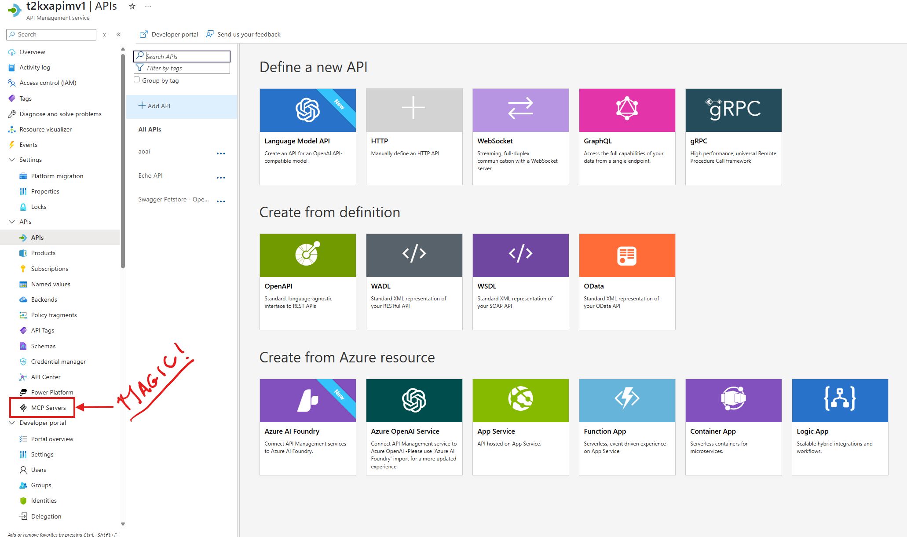
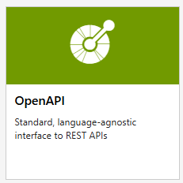
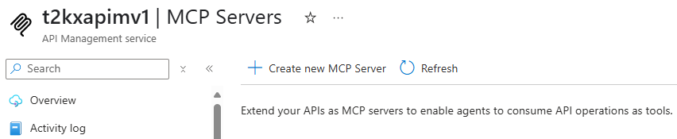
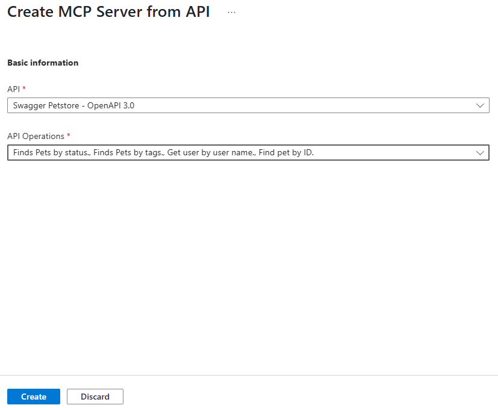
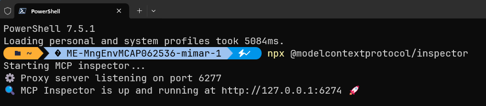
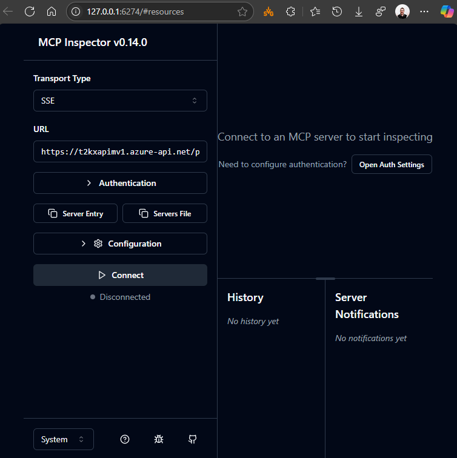
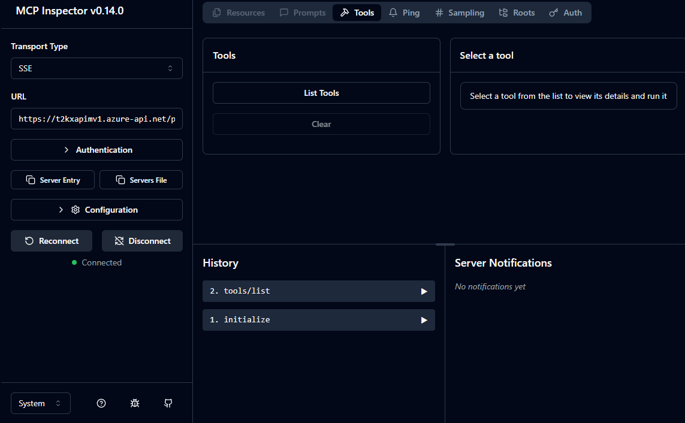

# Exposing MCP through APIM and APIC : Secure API and MCP handling - pt 2

## Exercise
### Add an REST API with OpenAPI 3x specs
By now our APIM instance should be enabled with the MCP capabilites as such. so we can continue.

APIM makes it really easy to add API's and MCP's. Since we are going to do both we'll start by adding an API.

**1.** First login to the portal, but this time using the preview portal for APIM MCP url :  https://portal.azure.com/?Microsoft_Azure_ApiManagement=mcp
it's the *"?Microsoft_Azure_ApiManagement=mcp"* parameter which will make the MCP part visible in the APIM blade.


**2.** For the fun of it we will add an OpenAPI 3x spec as an API, for this we will use the Petstore API : https://petstore3.swagger.io/api/v3
so for that choose OpenAPI



**3.** A wizard will appear (not Harry or Gandalf 😉) , fill it out with the following JSON schema https://petstore3.swagger.io/api/v3/openapi.json and make sure you have the *API URL suffix* as "petstore". 

Click **"Create"** to continue.
The API will now be in the list:


### Add the REST API as MCP
We now can consume the API's from withing the APIM and add them to the MCP Server registry
**1.** In the API Management service blade (the side panel with tools and config options) of your APIM gateway select the MCP Servers item:


**2.** Click the **"Create new MCP Server"**-button on top of the page. This will open up a wizard to create an MCP Server based upon your onboarded API's.


**3.** The wizards makes it easy for you, as you get to choose the API's which are already in APIm, and thanks to the OpenAPI specs it will expose all the methods and API Operations you have at your disposal per API.
For testing and exercise pick the Petstore API created earlier, and pick any of the API Operations you like.


Click **Create** and wait until the operation finishes.

**4.** You will be thrown back tot the main MCP servers page and it will now state the added MCP Server including it's SSE endpoint:

Copy the SSE endpoint URL already in your clipboard.

You have now created an MCP server and can start consuming it through any MCP capable client.

### Test the MCP Endpoint
#### MCP Inspector

The MCP inspector is a developer tool for testing and debugging MCP servers.


##### Architecture Overview

The MCP Inspector consists of two main components that work together:

- **MCP Inspector Client (MCPI)**: A React-based web UI that provides an interactive interface for testing and debugging MCP servers
- **MCP Proxy (MCPP)**: A Node.js server that acts as a protocol bridge, connecting the web UI to MCP servers via various transport methods (stdio, SSE, streamable-http)

Note that the proxy is not a network proxy for intercepting traffic. Instead, it functions as both an MCP client (connecting to your MCP server) and an HTTP server (serving the web UI), enabling browser-based interaction with MCP servers that use different transport protocols.

##### Requirements

- Node.js: ^22.7.5

### Exercise

The easiest way of testing and validating an MCP Server is through MCP Inspector, a package with Web UI to test and troubleshoot MCP Endpoints as stated above.

**1.** Open a terminal.

**2.** In the terminal type the below and press Enter.
```powershell-interactive
    npx @modelcontextprotocol/inspector
```
The server will start up and the UI will be accessible at `http://localhost:6274`.

**3.** Open the above localhost address in a browser.
**4.** Copy the SSE endpoint URL from the MCP Server blade in APIM if you don't have it in your clipboard anymore.
**5.** In the MCP Inspector WebUI paste the URL in the URL box and then press the **"Connect"** button.

**6.** Once connected you can now check out the available tools through the MCP Server:

Click on the "List tools" button to load them
 
**7.** You can even check all calls to the tools and see the cost of the calls in the "History" panel:
