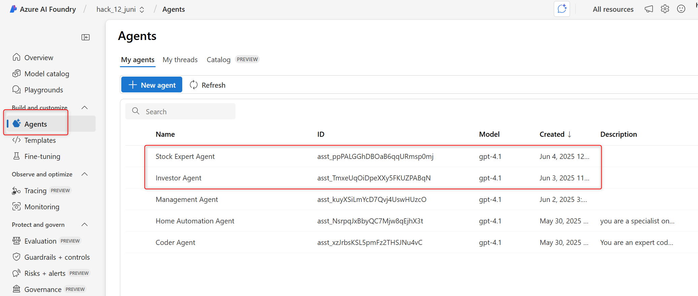
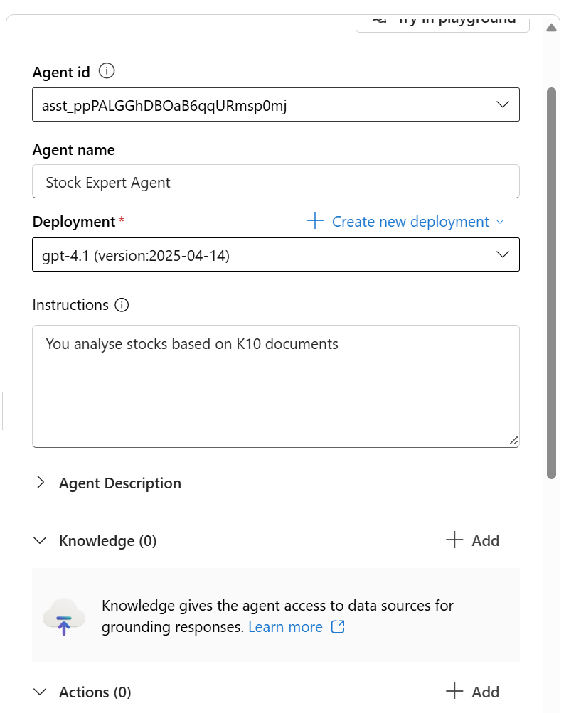
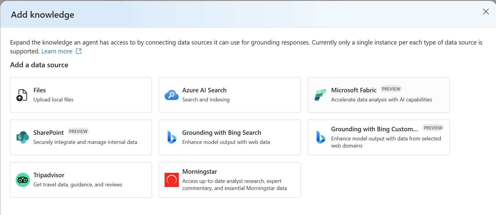
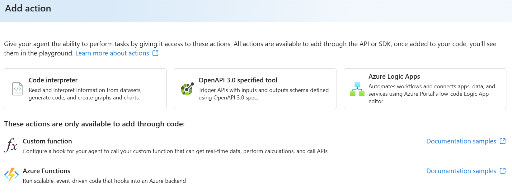

# Orchestrate Azure AI Foundry Agents with SK

In this lab, you will learn how to connect Agent that you create in Azure AI Foundry with Semantic Kernel.

Check out the appsettings.json which hold the environment variabels like Azure OpenAI Endpoints, APIs and AgentIDs that you created in 
AI Foundry:



When you create a Agents in there, the code will list them:

```
🤖 Azure AI Foundry Agents Orchestrator with Semantic Kernel
============================================================

📋 Listing all available agents in your Azure AI Foundry project:
   • Agent ID: asst_ppPALGGhDBOaB6qqURmsp0mj, Name: Stock Expert Agent, Model: gpt-4.1
   • Agent ID: asst_TmxeUqOiDpeXXy5FKUZPABqN, Name: Investor Agent, Model: gpt-4.1
   • Agent ID: asst_kuyXSiLmYcD7Qvj4UswHUzcO, Name: Management Agent, Model: gpt-4.1
   • Agent ID: asst_NsrpqJxBbyQC7Mjw8qEjhX3t, Name: Home Automation Agent, Model: gpt-4.1
   • Agent ID: asst_xzJrbsKSL5pmFz2THSJNu4vC, Name: Coder Agent, Model: gpt-4.1
```

You will also see that it will make the match with the AgentIDs that you have put in the appsettings.json file:

```json
 "Agents": {
    "StockExpertAgentId": "asst_ppPALGGhDBOaB6qqURmsp0mj",
    "InvestorAdvisorAgentId": "asst_TmxeUqOiDpeXXy5FKUZPABqN"
  },
```

```
🔍 Retrieving configured agents for orchestration...
   ✅ Successfully found Stock Expert agent: asst_ppPALGGhDBOaB6qqURmsp0mj
   ✅ Successfully found Investor Advisor agent: asst_TmxeUqOiDpeXXy5FKUZPABqN
```

The cool thing about creating Agents in Foundry, is that:
* Manage them very easily
<br> 

* Provide and ground them with Knowledge (Think Fabric!!!)
<br> 

* Provide them Actions (Functions, LogicApps, OpenAPI)
<br> 

With all this info, Semantic Kernel can setup a ChatGroup

```
🚀 Creating Semantic Kernel agent proxies and group chat...
   ✅ Agent group chat created successfully!

💬 Starting conversation between agents...
=====================================
```

What now:

1. Create some agents in Foundry
2. Add the IDs to the appsettings.json
3. adapt the code
4. dotnet build
5. dotnet run
