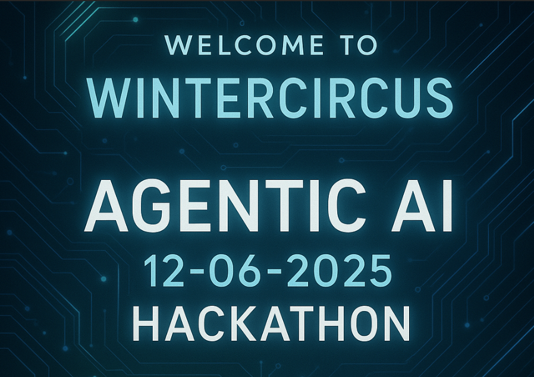
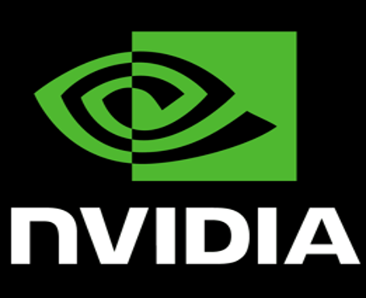
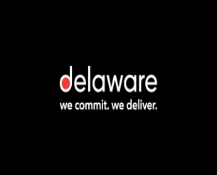

  
  
  

# 🎉 Welcome to the AI Agentic Hackathon at the WinterCircus! 🎉

We’re thrilled to have you join us for a full day of innovation, collaboration, and hands-on hacking at the intersection of AI and agentic systems. This event is proudly co-hosted by **NVIDIA**, **Delaware**, and our team — bringing together cutting-edge technology and deep expertise to help you build the next generation of intelligent solutions.

Throughout the day, you’ll also hear from inspiring speakers from **GitHub** and the **Semantic Kernel** team, who will share insights, lead sessions, and be on hand to support while you hack.

We'll also be learning from others so make sure to pay attention when **LegalFly** takes the stage to talk about
their Agentic AI journey.

 

## Introduction

The hack is build around 3 modules:

1. [Module1 : Prepare AI Foundry & Setup NIM](/June_12_Demo/Module1%20[Prep%20and%20NIM])
    
   ✓ Configure AI Foundry
    
   ✓ Deploy Models
    
   ✓ Deploy Nvidia NIM AKS CLuster
    
   ✓ Expose Llama3 Endpoint
    
    
2. [Module2 : Semantic Kernel Labs](/June_12_Demo//Module2%20[Semantic%20Kernel])
    
   ✓ Intro to Semantic Kernel
    
   ✓ Semantic Kernel Agents
    
   ✓ Semnatic Kernel MCP Integration
    
   ✓ Semantic Kernel Process-Framework
    
    
3. [Module3 : Extra Excercises](/June_12_Demo/Module3%20[Extra%20exercises])
    
   ✓ Deploy an MCP Server in an Azure Container Instance
    
   ✓ Use Semantic Kernel to connect to the MCP server
    
   ✓ Use Semantic Kernel to Orchestrate agents in Foundry
    
   ✓ Use AI Gateway (APIM) in front of MCP server(s) and use Authentication
    
   
   